---
{"dg-publish":true,"permalink":"/reuse/laptops/how-do-i-tips-and-tricks/procedures/laptop-refurb-procedure/main-laptop-refurbishment-procedure/","tags":["procedure","laptops","refurbishment"]}
---

# Laptop Refurbishment Procedure

Complete workflow for evaluating, testing, and refurbishing donated laptops.

```mermaid
flowchart TD
    A[Start with SDA-Cleared Laptop] --> B[Initial Inspection]
    B --> C{Passed Inspection?}
    C -- No --> D[Recycle Bin]
    C -- Yes --> E[Find Power Adapter]
    E --> F[Power On Test]
    F --> G{Power On Success?}
    G -- No --> H[Troubleshoot Power]
    G -- Yes --> I[Configure BIOS/UEFI]
    I --> J[Install Drive]
    J --> K[Boot to USB/QA Helper]
    K --> L[Install OS & Complete Testing]
    L --> M[Update Inventory & Labels]
    M --> N[Final Cleanup & Packaging]
    N --> O[📦 Ready for User!]
```

## 🔄 Quick Workflow
1. **[[Reuse/Laptops/How Do I (Tips and Tricks)/Procedures/Laptop Refurb Procedure/Laptop Inspection & Triage\|Laptop Inspection & Triage]]** - Initial assessment
2. **[[Reuse/Laptops/How Do I (Tips and Tricks)/Procedures/Laptop Refurb Procedure/Power Adapter Guide\|Power Adapter Guide]]** - Find correct power supply
3. **[[Reuse/Laptops/How Do I (Tips and Tricks)/Procedures/Laptop Refurb Procedure/BIOS-UEFI Configuration\|BIOS-UEFI Configuration]]** - Essential settings
4. **[[Reuse/Laptops/How Do I (Tips and Tricks)/Procedures/Laptop Refurb Procedure/Drive Installation\|Drive Installation]]** - SSD/M.2 installation
5. **[[Reuse/Laptops/How Do I (Tips and Tricks)/Procedures/Laptop Refurb Procedure/OS Installation & Testing\|OS Installation & Testing]]** - QA Helper process
6. **[[Reuse/Laptops/How Do I (Tips and Tricks)/Procedures/Laptop Refurb Procedure/Inventory & Final Steps\|Inventory & Final Steps]]** - Completion workflow

## 🎯 Before You Start
- Laptop must be **SDA-cleared** (data-bearing components removed)
- Work in designated **laptop refurbishment area**
- Start with **business-grade models** if you're new (Dell Latitude, Lenovo ThinkPad)

## ⚠️ Quick Recycle Criteria
If laptop has **ANY** of these → **Divert to Recycling**:
- Cracked screen
- Multiple broken components
- Severe structural damage
- Animal infestation (yes, really!)
- Broken hinges or large cracks

## 📚 Related Procedures
- [[Reuse/Laptops/How Do I (Tips and Tricks)/Tips/PGO Triage (Picking Good Ones)\|PGO Triage (Picking Good Ones)]]
- [[Reuse/Laptops/How Do I (Tips and Tricks)/Procedures/Sticker Removal Procedure\|Sticker Removal Procedure]]
- [[Reuse/Laptops/How Do I (Tips and Tricks)/Procedures/Metal Shavings on Speaker Grills Removal\|Metal Shavings on Speaker Grills Removal]]
- [[Reuse/Laptops/How Do I (Tips and Tricks)/Tips/Dell Tips\|Dell Tips]]

---
*Complete this full process to prepare laptops for community use*