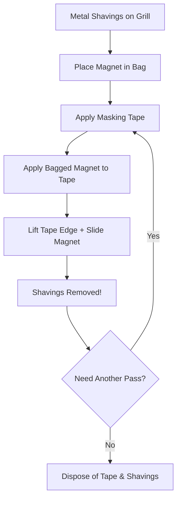

---
{"dg-publish":true,"permalink":"/reuse/laptops/how-do-i-tips-and-tricks/procedures/metal-shavings-on-speaker-grills-removal/","tags":["procedure","laptop-repair"]}
---

> [!question] Metal shavings on your laptop speaker?
> **Here's a safe and effective way to remove them using magnetism and adhesion.**
> 
> 

> 
<b>Click for Detailed Instructions</b>

> 
> #### **Gather Your Supplies:**
> - **Plastic baggie** (big enough to hold a magnet)
> - **Strong magnet** (a neodymium magnet from an old hard drive is perfect)
> - **Masking tape** (or another low-tack tape)
> 
> #### **Step-by-Step Guide:**
> 1. **Bag the Magnet:** Put the hard drive magnet inside the plastic baggie. This keeps the shavings from permanently sticking to the magnet.
> 2. **Apply Tape:** Place a piece of masking tape over the speaker grill, sticky side down. Press firmly to ensure contact with the shavings.
> 3. **Combine Forces:** Place the bagged magnet on top of the tape, directly over the shavings.
> 4. **The Key Move:** Slowly pull up one edge of the tape while simultaneously holding the magnet against that same edge. The magnet will pull the shavings up and towards the adhesive.
> 5. The shavings should be captured on the tape. Fold the tape onto itself to contain the metal for safe disposal.
> 
> #### **Why This Works:**
> This method uses a powerful two-pronged approach:
> - The **magnet** provides a strong pulling force on the ferrous metal.
> - The **tape's adhesive** grabs any particles the magnet might miss and acts as a barrier, ensuring the shavings are collected and don't fall back into the laptop.
> 
> 

## 🔗 Related
- [[Reuse/Laptops/How Do I (Tips and Tricks)/Procedures/Procedures\|Procedures]]