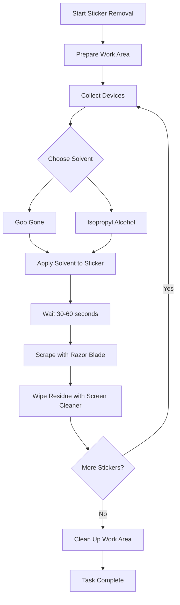

---
{"dg-publish":true,"permalink":"/reuse/laptops/how-do-i-tips-and-tricks/procedures/sticker-removal-procedure/","pinned":true,"tags":["procedure","safety","sticker-removal"]}
---

# Sticker Removal Procedure

## 🎯 Purpose
Safely remove stickers from computers and electronic devices using proper techniques and safety precautions.

## 🛡️ Required PPE
- **Required:** Nitrile or Latex gloves
- **Recommended:** Safety glasses
- **Optional:** Cut-resistant gloves for razor work

## 📋 Materials Needed
- Goo Gone OR Isopropyl Alcohol (70% or higher)
- Razor blade with carrier/holder
- Screen cleaner
- Clean cloths/rags
- Designated waste container for solvent rags (Do not put soggy rags in the trash!)

## 🔄 Step-by-Step Process

### 1. Prepare Work Area
- Ensure clean, well-ventilated workspace
- Remove any heat sources or open flames
- Adjust chair for comfort
- Open window or use fan for air circulation

### 2. Collect Devices
- Use safe lifting techniques
- For multiple devices, use a cart
- Be aware of sharp edges

### 3. Apply Solvent
**Choose one:**
- **Goo Gone:** Spray directly onto sticker
- **Isopropyl Alcohol:** Apply with cloth or spray bottle

**Safety:**
- Spray away from body and eyes
- Wear gloves to prevent skin contact
- Use minimal amount needed

### 4. Wait for Saturation
- Let solvent sit for 30-60 seconds
- Do not oversaturate
- Avoid dripping

### 5. Scrape Sticker
- Use razor blade with carrier
- **Push blade away from your body**
- Keep fingers clear of blade edge
- Take microbreaks if doing multiple devices

### 6. Clean Residue
- Wipe area with screen cleaner
- Use clean cloth
- Dispose of solvent-soaked rags in designated container (or lay out to dry thoroughly)

### 7. Repeat or Clean Up
- Repeat steps for additional stickers
- Clean work area when finished
- Return chemicals to proper storage

## ⚠️ Safety Warnings

| Hazard | Prevention |
|--------|------------|
| 🔥 Flammable vapors | No open flames, good ventilation |
| ✋ Skin irritation | Wear gloves, avoid contact |
| 🔪 Cuts | Use blade carrier, push away from body |
| 💨 Chemical vapors | Work in well-ventilated area |

## ✅ Quality Check
- All sticker residue removed
- No damage to device surface
- Work area clean and organized
- Waste materials properly disposed

## 🔗 Related Documents
- [[Safety Committee/Safety NW Feedback/Sticker Removal JHA\|Sticker Removal JHA]]
- [[Chemical Safety Procedures\|Chemical Safety Procedures]]
- [[PPE Requirements\|PPE Requirements]]
- [[Templates/Procedure\|Templates/Procedure]]

---
*Based on JHA assessment by Dacian Garhartt & Quinn McLaughlin, September 2025*